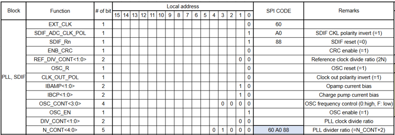
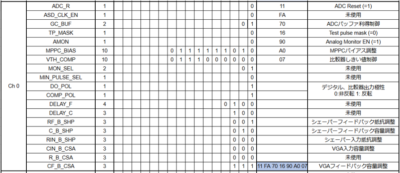

# YAENAMI ASIC

## YAENAMI version 3

YAENAMI ASIC v3 については[pdf](./YAENAMI.pdf)を参照してください。

## Supplement for version 1

上記PDFにはv1に関する記述がないため、YAENAMI v1内部レジスタについて捕捉します。

{: #v1-reg-pll width="100%"}

ASIC全体の動作に関わる部分です。通常ユーザーはこのブロックの情報を変更しません。

{: #v1-reg-ch width="100%"}

チャンネルごとに個別に設定するレジスタです。
[図](#v1-reg-ch)では代表としてチャンネル0のテーブルを示しています。
一番上部の`ADC_R`は、チャンネル0の領域にだけ存在する特殊なレジスタです。
`ADC_R`を1にするとASIC内部のADCがリセットされます。
他のチャンネルではこの領域は未使用です。

{: #v1-reg-adc width="100%"}

ADCとVCM DACに関するレジスタテーブルです。
ユーザーが積極的に変更することはまれだと思います。

各レジスタ値についての補足説明を以下に示します。

|レジスタ名|ビット数|デフォルト値|説明|
|:----|:----|:----|:----|
|EXT_CLK|1|0|内部PLLのクロックの代わりに外部入力のクロックを使う。ユーザーは触らない。|
|SDIF_ADC_CLK_POL|1|1|SDIFへのクロックの極性を変更する。ユーザーは触らない。|
|SDIF_Rn|1|1|SDIFのリセットを行う。負論理。|
|ENB_CRC|1|0|CRC計算を有効にする。（未使用で運用する。運用すると4bitのCRCコードが付与されるためファームウェアの変更が必須）|
|REF_DIV_CONT|2|0|REFCLKに対する分周比を決める。入力が高い場合に使用するが位相差を生むので通常0。|
|OSC_R|1|0|発振器リセット。ユーザーは触らない。|
|CLK_OUT_POL|1|0|PLLからのクロック出力の極性を変更する。ユーザーは触らない。|
|IBAMP|2|2|OPAMPのカレントバイアスを決める。性能に影響はない。ユーザーは触らない。|
|OSC_CONT|4|4|発振器の周波数コントロール。REFCLKの周波数が高い時は値を小さくする。REFCLK>50MHzの場合は0b0000での運用で差し支えない。|
|OSC_EN|1|1|発振器イネーブル|
|DIV_CONT|2|0|PLLからのクロック出力を分周。分周比 2^DIV_CONT|
|N_CONT|5|8|PLL発振逓倍数制御。(N+2)xREFCLK|
|ADC_R|1|0|ADCリセットを行う。複数ASICがある場合同時にこのレジスタをたたく事でデータ送信の位相を揃えることができる。|
|ASD_CLK_EN|1|0|未使用|
|GC_BUF|2|2|ADCドライバのゲインコントロール。大きいほど利得大。|
|TP_MASK|1|0|テストパルス入力をマスクする。0でマスク。|
|AMON|1|0|アナログモニターへ該当チャンネルを接続する。1で接続。複数チャンネルを接続しないようにする。|
|MPPC_BIAS|10|0|MPPCバイス調整用DAC。3.3Vまで3.2mVステップで上昇する。右図を参照。|
|VTH_COMP|10|192|コンパレータ閾値。3.3Vまで3.2mVで上昇する。ベースラインはVCM_DACで設定した位置になる。|
|MON_SEL|2|1|未使用。1で固定。|
|MIN_PULSE_SEL|1|0|未使用。0で固定。|
|DO_POL|1|1|コンパレータ信号をデジタル出力のドライバ前で極性反転させる。0で非反転1で反転。|
|COMP_POL|1|1|コンパレータ動作の反転を行う。0で閾値より高い時にHIGH、1で閾値より低い時にHIGHとなる。|
|DELAY_F|4|4|未使用。4で固定。|
|DELAY_C|3|4|未使用。3で固定。|
|RF_B_SHP|3|0|シェーパーのフィードバック抵抗値。有効値は1,2,3,4の4段階。|
|C_B_SHP|3|0|シェーパーのフィードバックキャパシタ値。大きいと時定数は大きくなるがベースラインノイズは小さくなる。8段階。|
|RIN_B_SHP|3|7|シェーパーの入力抵抗値。有効値は0,1,2,4の4段階。|
|CIN_B_CSA|3|7|ただしくはVGAの入力キャパシタ値。整数値としてではなく、ビット1つにつき1つCが接続される。4段階。|
|R_B_CSA|3|0|未使用|
|CF_B_CSA|3|0|ただしくはVGAのフィードバックキャパシタ値。整数値として解釈され8段階。|
|ASD_R|2|0|未使用.|
|GD_BUF|2|2|誤記。GC_BUFと同じ。|
|CAL_EN|1|0|ADCキャリブレーションを行う。ASIC初期化に使用する。|
|CAL_REG_R|1|0|ADCキャリブレーションで求まった値を消す。ユーザーは触らない。|
|SAM_WD|2|1|ADCのサンプリング期間の変更。ユーザーは触らない。|
|VCM_DAC|10|512|整形増幅回路のベースライン電圧を決める。通常中点が望ましいが、変更する事で片側の極性のダイナミックレンジが広がる。|
